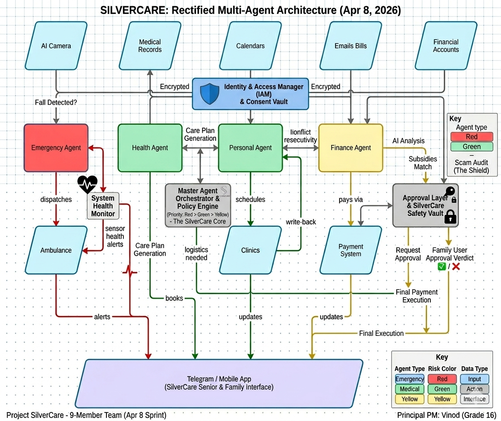
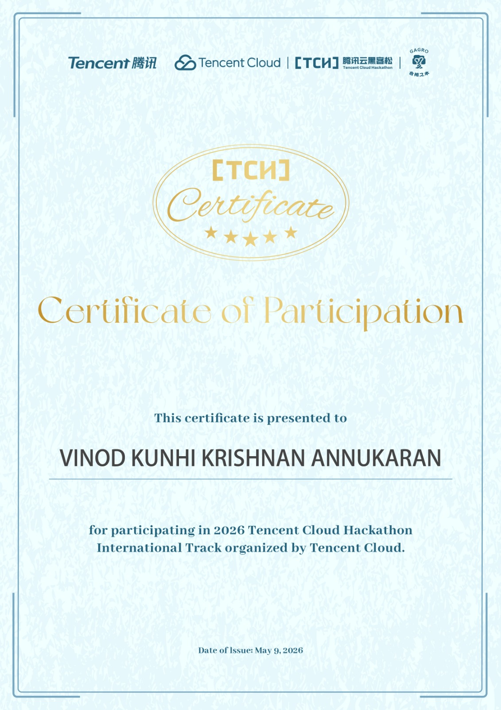

# 🏆 Nak Nak — AI Elder Care System

**Tencent Global AI Hackathon Singapore 2026 — TOP 10 Finalist (out of 110 teams)**

## Overview
Voice-enabled multi-agent AI system addressing Singapore's $4.2T Silver Economy — designed to be the 24/7 intelligent companion for elderly living alone.

## Architecture & Tech Stack

## Key Features
- **4 Claude-powered AI Agents:** Emergency, Health, Finance, Personal
- **AI Safety:** NeMo Guardrails, Red/Blue Team testing (90% safety score), prompt injection blocking
- **Human-in-the-loop:** Family approval for financial transactions, dual-authorization, full audit trail
- **Singapore-specific:** CPF integration, DBS/OCBC APIs, multi-language (English, Mandarin, Malay, Tamil)

## My Role: Product Manager
- Defined product strategy and agent architecture
- Designed governance layer (which agent handles what, handoff rules, authorization)
- Led AI safety implementation (guardrails, red-teaming, trust thresholds)
- Made PM trade-offs: 4 specialized agents vs 1 generalist (accuracy + permission boundaries)

## Presentation
[View Full Presentation (PDF)](./NakNak-AI-Elder-Care.pdf)

## Certificate

## Result
**TOP 10** out of 110 global submissions. Judges praised safety-first approach and governance design.

---
*Built at CodeBuddy × GLM Global AI Hackathon Singapore 2026*
*Team role: Product Manager & AI Safety Lead*
